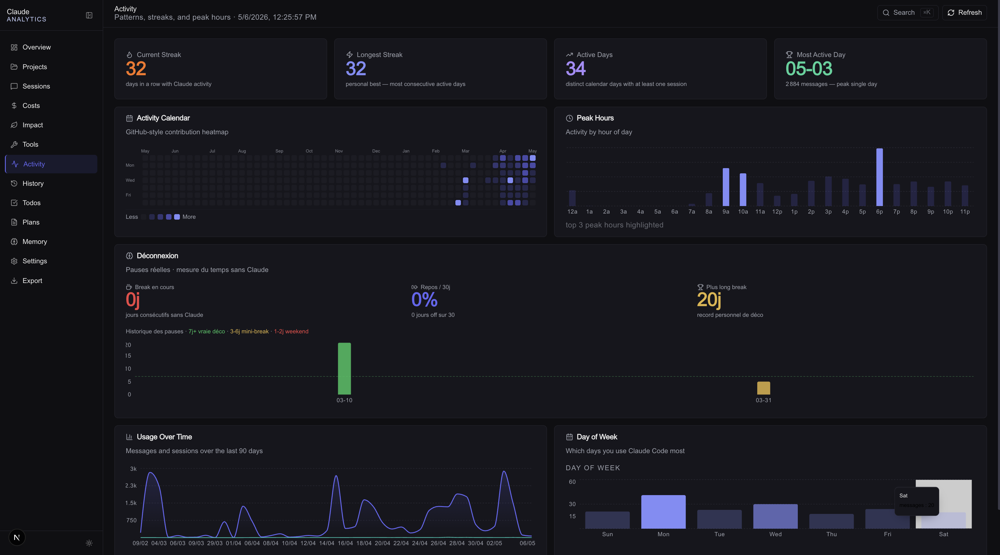
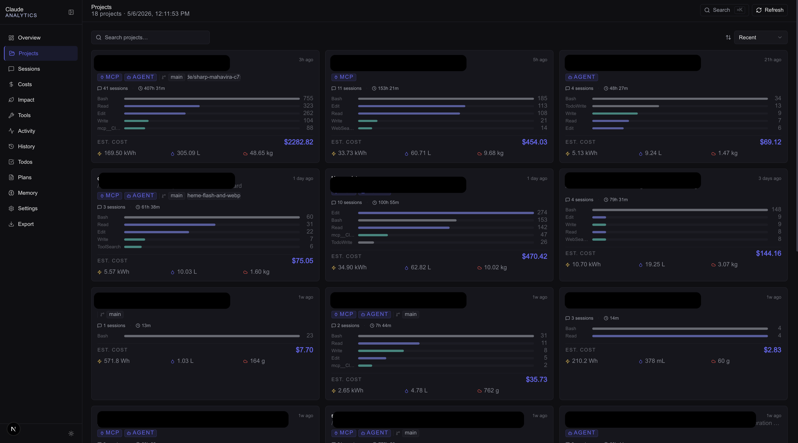
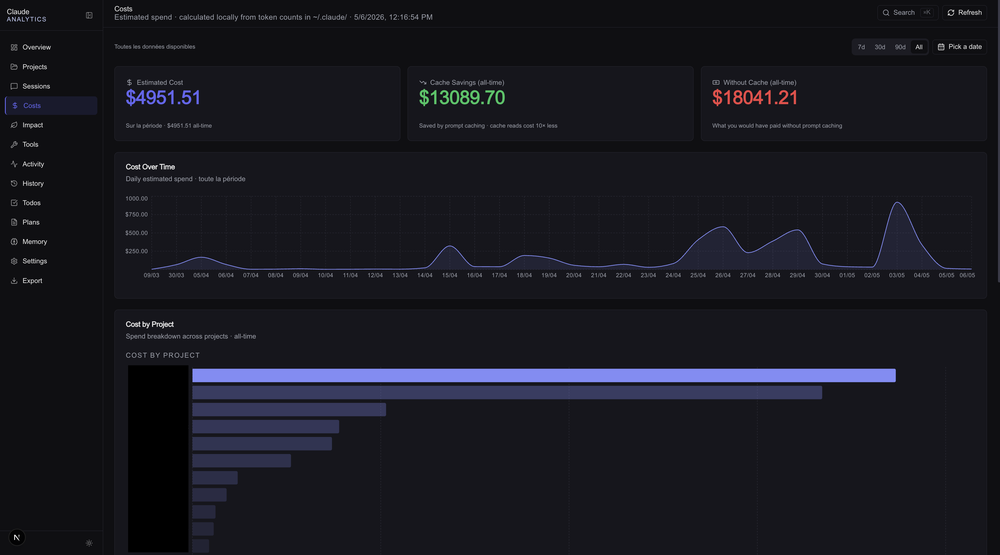
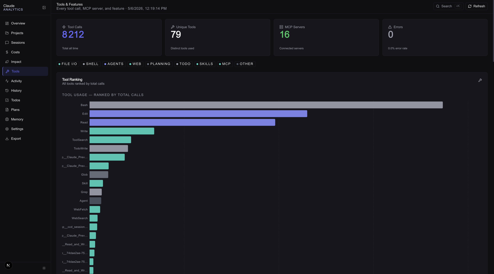

<picture>
  <source media="(prefers-color-scheme: dark)" srcset="./public/dashboard-dark.png" />
  <source media="(prefers-color-scheme: light)" srcset="./public/dashboard-white.png" />
  
</picture>

# cc-lens — Claude Code Analytics Dashboard

**Local-first analytics for Claude Code. No cloud. No API key. No telemetry. Just your `~/.claude/` data, visualized.**

```bash
npx cc-lens
```

> Forked from [Arindam200/cc-lens](https://github.com/Arindam200/cc-lens) and extended with environmental impact tracking, mental health awareness, and UX fixes.

---

## Why this fork?

The original cc-lens is a great technical dashboard. This fork adds two dimensions that matter beyond the tokens:

- 🌱 **Ecological footprint** — LLM inference has a real energy and water cost. This dashboard makes it visible.
- 🧠 **Mental health** — AI tools can blur the line between work and rest. The disconnection panel helps you track when you actually unplug.

---

## Quick Start

```bash
npx cc-lens
```

The CLI finds a free local port, starts the dashboard, and opens your browser. On first run, a small cache is created in `~/.cc-lens/`. Subsequent launches are faster.

To point at a different Claude Code profile:

```bash
CLAUDE_CONFIG_DIR=~/.claude-work npx cc-lens
```

---

## What's inside

### Overview

<picture>
  <source media="(prefers-color-scheme: dark)" srcset="./public/dashboard-dark.png" />
  <source media="(prefers-color-scheme: light)" srcset="./public/dashboard-white.png" />
  
</picture>

Sessions, tokens, estimated cost, and local storage — at a glance. Trend cards with sparklines, date presets (7d / 30d / 90d / custom), model distribution, peak hours, project activity, and recent sessions.

---

### 🌱 Environmental Impact *(added in this fork)*

> *"Every token has a cost beyond dollars."*

A dedicated **Impact** page estimates the energy (Wh), water (mL), and CO₂ (g) consumed by your Claude usage — broken down by model, day, and token type.

**How it works:**
- Energy coefficients back-solved from Epoch AI research on LLM inference (input: 390 Wh/MTok, output: 5× more at 1 950 Wh/MTok)
- PUE 1.14 (AWS datacenter overhead) applied
- Water Usage Effectiveness: 1.8 mL/Wh
- Carbon intensity selectable by grid: 🇺🇸 US (0.287 g/Wh) · 🇪🇺 EU (0.25) · 🇫🇷 France (0.06, nuclear-dominant)
- Model-size multipliers: Opus × 2.5 · Haiku × 0.4 · Sonnet × 1.0

**Panels:**
- Hero KPIs (windowed + all-time): energy, water, CO₂
- Relatable equivalences: LED hours, EV km, glasses of water, car km, flights Paris → NY
- Impact over time chart (toggleable: energy / water / CO₂)
- Impact by model (who's the biggest footprint?)
- Token-type breakdown donut (output tokens dominate)
- Full factors table with sources for transparency

---

### 🧠 Disconnection *(added in this fork)*



> *From the "AI Brain Fry" discussion: are you actually unplugging?*

Inside the **Activity** page, a new **Déconnexion** block tracks the gaps — the time you spent *without* Claude.

| Metric | What it means |
|---|---|
| **Break en cours** | Consecutive days without Claude (0 = you used it today) |
| **Repos / 30j** | % of the last 30 days with no activity |
| **Plus long break** | Your personal rest record |

A bar chart shows every disconnection gap in your history, color-coded by duration:
- 🔴 1–2 days — weekend
- 🟡 3–6 days — mini-break
- 🟢 7+ days — genuine disconnection

The 7-day reference line is there to remind you what a real break looks like.

---

### Projects



Searchable, sortable project grid. Per-project cards with sessions, duration, estimated cost, languages, git branches, MCP/agent badges, and top tools. Project detail pages with cost over time, language distribution, branch activity, and tool usage.

---

### Sessions


Full session replay reconstructed from JSONL. Searchable session table with badges for compaction, agents, MCP, web search, and extended thinking. Assistant responses in GitHub-flavored Markdown. Tool calls, file read/write cards, per-turn cost, and compaction events with token accumulation chart.

---

### Costs



Total estimated cost, cache savings, cost without cache, cost over time, cost by project, per-model breakdown, and cache efficiency panel. Pricing from `lib/pricing.ts` — update it if provider rates change.

---

### Tools & Features



Tool ranking, categories (file I/O, shell, agents, web, MCP…), MCP server usage, feature adoption, error analysis, version history, git branch analytics.

---

### Activity


GitHub-style heatmap, current streak, longest streak, peak hours, day-of-week patterns — and the Disconnection panel above.

---

### Local Claude Code Files


History, Todos, Plans, Memory, and Settings — all read directly from `~/.claude/`.

---

## Navigation

- Global search: `Cmd+K` / `Ctrl+K` / `/`
- Session navigation: `j` / `k` to move, `Enter` to open, `Esc` to clear
- Page shortcuts: `g s` → Sessions · `g p` → Projects · `g c` → Costs
- Responsive: desktop sidebar, collapsible nav, mobile bottom nav
- Light and dark themes

---

## Privacy

cc-lens runs **entirely locally**. It reads files from `~/.claude/` and starts a local web server. No login, no API key, no telemetry, no cloud. Your data stays on your machine.

---

## Data Sources

| File | Used for |
|---|---|
| `~/.claude/projects/<slug>/*.jsonl` | Session replay, tokens, tool calls |
| `~/.claude/stats-cache.json` | Aggregate stats (fast path) |
| `~/.claude/usage-data/session-meta/` | Session metadata fallback |
| `~/.claude/history.jsonl` | Command history |
| `~/.claude/todos/` | Todo files |
| `~/.claude/plans/` | Saved plans |
| `~/.claude/projects/*/memory/` | Project memory |
| `~/.claude/settings.json` | Settings, skills, MCP config |

---

## Run From Source

**Prerequisites:** Node.js 18+, Claude Code with local data in `~/.claude/`

```bash
git clone https://github.com/sebWarembourg/cc-lens.git
cd cc-lens
npm install
npm run dev        # → http://localhost:3333
```

```bash
npm run build
npm start
```

---

## Cost Estimates

Token counts and model identifiers come from Claude Code. Costs are estimated using `lib/pricing.ts`. Update it if Anthropic pricing changes.

Environmental impact estimates are based on public research (Epoch AI, IEA, FAO). They are approximations — see the **Factors** section in the Impact page for sources and limitations.

---

## Credits

Built on [cc-lens](https://github.com/Arindam200/cc-lens) by [@Arindam200](https://github.com/Arindam200). Extended by [@sebWarembourg](https://github.com/sebWarembourg) with Impact tracking, Disconnection panel, and UX fixes.
